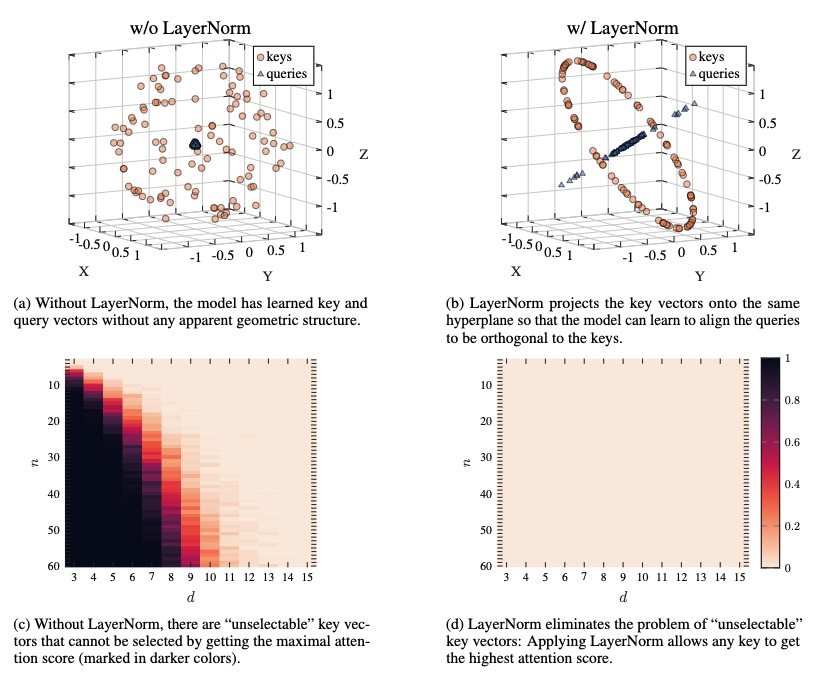

# On the Expressivity Role of LayerNorm in Transformers' Attention

This repository contains the code for reproduce the results from "On the Expressivity Role of LayerNorm in Transformers' Attention" (Findings of ACL'2023) [[PDF]](https://arxiv.org/pdf/2305.02582.pdf).



## Setup

Make sure you have [wandb.ai](wandb.ai) user and that you are [logged](https://docs.wandb.ai/ref/cli/wandb-login) into your machine.

Install the required python packages:
```
pip install -r requirements.txt 
```

Gurobi is needed to find unselectable keys, and requires a license. See in [here](https://www.gurobi.com/academia/academic-program-and-licenses/).

## Hardware
In general, all experiments can run on either GPU or CPU. 

## Code Structure

1. The `majority` subdirectory contains the files needed to reproduce the results of the Majority task (Figure 1a, 1b, 2, 3).
2. The `unselectable` subdirectory contains the files needed to reproduce the results of the unselectable experiments (Figure 1c, 1d, 4, Table 1, 2).

## Citation
[On the Expressivity Role of LayerNorm in Transformers' Attention](https://arxiv.org/pdf/2305.02582.pdf)
```
@article{brody2023expressivity,
  title={On the Expressivity Role of LayerNorm in Transformers' Attention},
  author={Brody, Shaked and Alon, Uri and Yahav, Eran},
  journal={arXiv preprint arXiv:2305.02582},
  year={2023}
}
```
