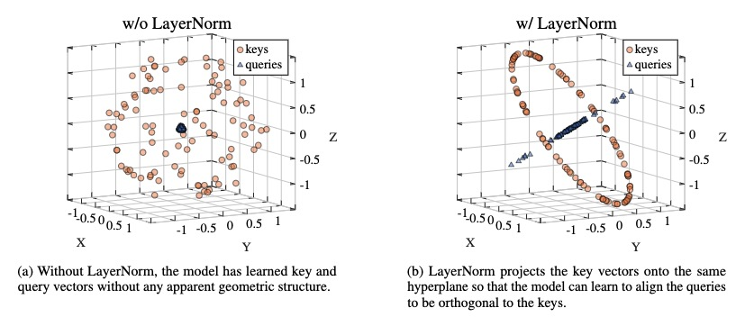
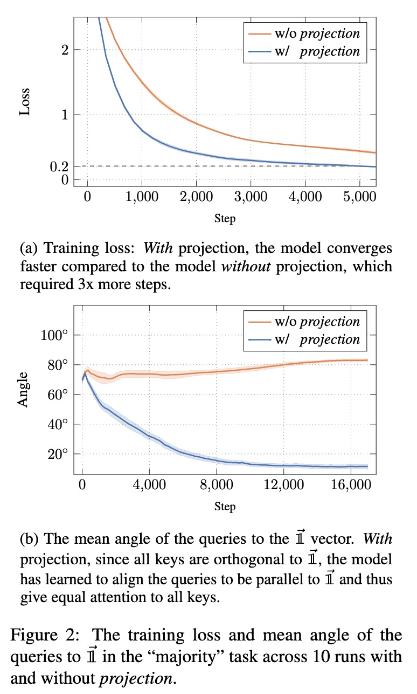
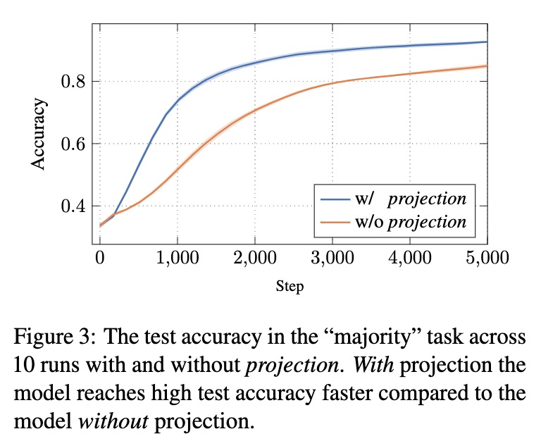

# Majority

## Figures 1a, 1b
To replicate Figures 1a, 1b run the following commands:
```
bash run_with_projection_3d.bash
bash run_without_projection_3d.bash
```
Then, you need to create `.jsonl` files with the keys and queries from the runs.

Create the following files:
 ```
WITH_PROJ_keys_queries.jsonl
WITHOUT_PROJ_keys_queries.jsonl
```
so that each line contains the summary of a run (you can find the summary in wandb UI or in `wandb/<run_name>/files/wand-summary.json`)
Then run the following script:
```
python visualize_3d_keys_queries.py
```
The results are `{WITH_PROJ,WITHOUT_PROJ}_keys_queries.png`.

## Figures 2, 3
Use the following commands to run the "majority" experiments:
```
bash run_with_projection.bash
bash run_without_projection.bash
```
Watch the results on your console at [wandb.ai](wandb.ai).

Note that the scripts distribute the various runs using [slurm workload system](https://slurm.schedmd.com/documentation.html).

## Results

The results of running the above scripts are:

Figures 1a, 1b:



Figure 2:



Figure 3:

