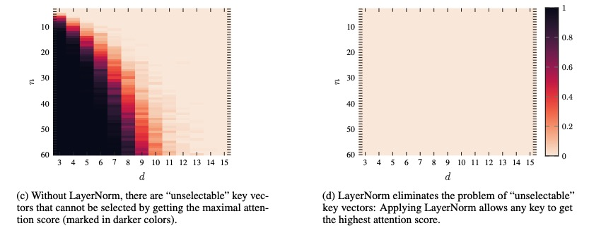
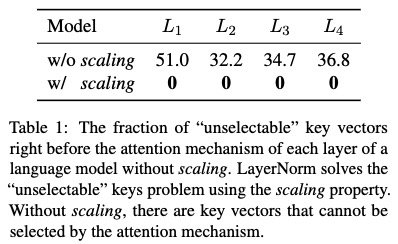
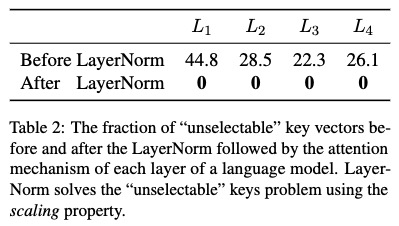
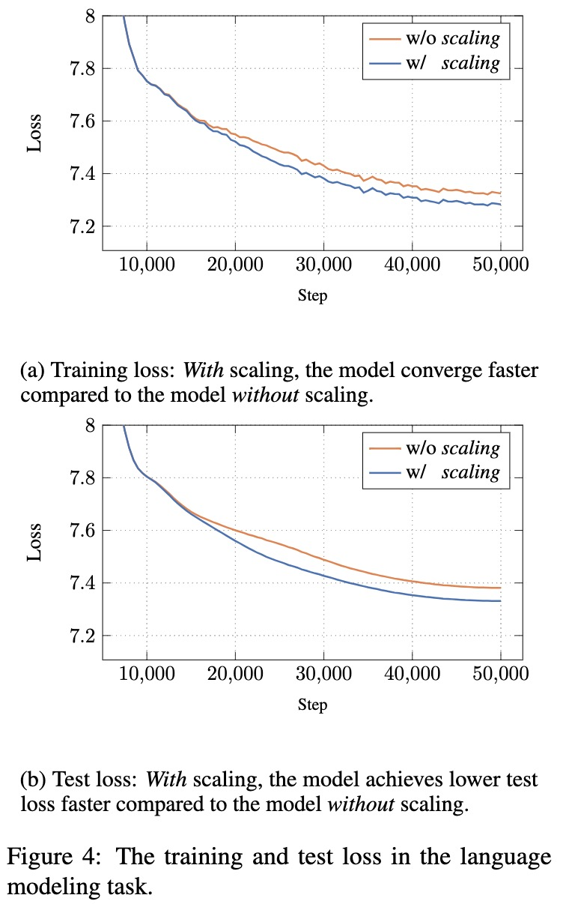

# Unselectable

Use the following commands to run the ``unselectable'' experiments:

```
bash unselectable_experiments.bash
```

The results shown in Table 1 and Table 2 will be in `unselectable_with_scale` and `unselectable_without_scale`.
Note that Table 2 compares the unselectable before and after LayerNorm which is equivalent to the __with_scale__ model.

Figures 1c, 1d will be in `unselectable_rand_exp`.
Figure 4: The training and test loss can be found on your console at [wandb.ai](wandb.ai).

The results of Table 3 will be in `unselectable_without_scale`.

The results of Table 4 will be in `unselectable_no_ln_bert`.

## Results 

The results of running the above scripts are:

Figures 1c 1d:



Table 1:



Table 2:



Figure 4:

